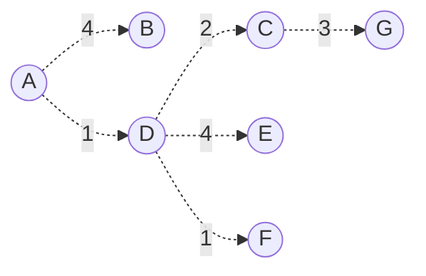

# Tema 6 El nivel de red:

## Corrección de ejercicios

### Ejercicio 10

### Ejercicio 11

De una red, la de difusión es la dirección de la siguiente red menos uno. Por ejemplo, de la 168.35.144.0/20 sería 168.35.159.255 . 

En el apartado **d)** si que se quita también la del **router** porque especifica direcciones de **host**.

### Ejercicio 14

## Ejercicios de agregación en tablas de reenvío de routers

Se trata de pasarlo a binario y ver los bits que tienen en común y agruparlos (en los casos en los que se pueda).

En este ejemplo son 8 redes las que se han agrupado y por tanto no es correcta. Si no se puede así, se hace por partes.

> **Hay una errata en la siguiente transparencia, no es un /25, es un /23**

## Ejercicio E10

| Paso | N'        | D(B), p(B) | D(C), p(c) | D(D), p(D) | D(E), p(E) | D(F), p(F) | D(G), p(G) |
| ---- | --------- | ---------- | ---------- | ---------- | ---------- | ---------- | ---------- |
| 0    | A         | **4,A**    | $\infty$   | **1,A**    | 6,A        | $\infty$   | $\infty$   |
| 1    | A,D       | -          | **3,D**    | -          | **5,D**    | **2,D**    | $\infty$   |
| 2    | A,D,F     | -          | -          | -          | -          | -          | -          |
| 3    | A,D,F,C   | -          | -          | -          | -          | -          | **6,C**    |
| 4    | A,D,F,G   | -          | -          | -          | -          | -          | -          |
| 5    | A,D,F,G,E | -          | -          | -          | -          | -          | -          |

## Ejercicio E12
